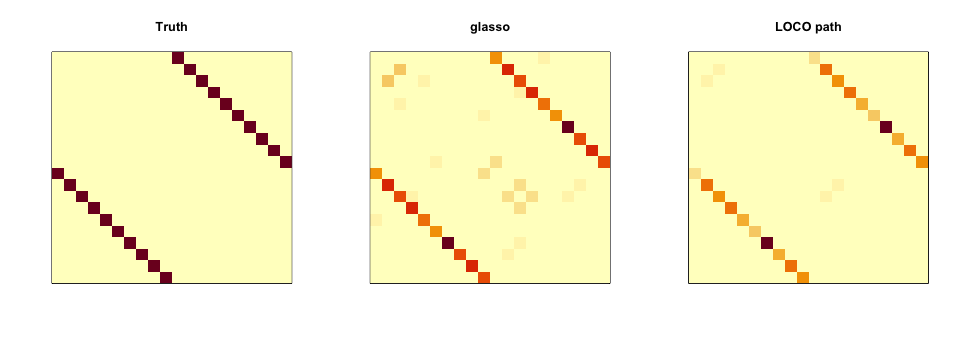

# LOCOpath project code repo
This github repo contains all project code for the LOCO path high dimensional inference.
Apart from the code listed here, you may also need to install the R package [```LOCOpath```](https://github.com/devcao/LOCOpath).

## Install the R package

To install, please first install R package ```devtools``` and then 
```R
devtools::install_github("devcao/LOCOpath")
```

## Road map for the core R code.

[NetTS.R](./NetTS.R):  LOCO path statistic calculations for linear/logistic/Poisson regression, backend R package ```glmnet```.

[NetResampleTS.R](./NetResampleTS.R):  Bootstrapping and power simulation code based on LOCO path statistic for **linear** regression, backend R package ```glmnet```.

[NetResampleLogisticTS.R](./NetResampleLogisticTS.R):  Bootstrapping and power simulation code based on LOCO path statistic for **logistic/Poisson** regression, backend R package ```glmnet```, ```gglasso``` and [Logistic_Enet.R](./Logistic_Enet.R) .

[Logistic_Enet.R](./Logistic_Enet.R): Modified coordinate descent for logistic regression, enabling constraint like beta_1=1 while looping the coordinate descent, backend C++ code [lognet.cpp](./lognet.cpp) .

[graphLASSO.R](./graphLASSO.R): All the graphical LASSO code, including our wrapper of ```glasso``` package, our own constraint graphical LASSO code and variable screening code, backend R package ```glasso```.

[compare_power.R](./compare_power.R): All the power simulation codes for other method we need to compare, including desparsified LASSO, T/F/Wald test.

## Power simulation functions and examples
In the data generating part, we use **rho** to specify the correlation structure
```R
 #  rho: can be 'equl': compound symmetry with correlation = 0.8
 #              'weak_equl': compound symmetry with correlation = 0.5
 #               positive value:  toeplitz matrix with correlation = rho, the specified value
 #               0: independent case
```

### High-dimensional linear regression 
#### Testing beta_j = 0 or non zero value
Use ```lars``` as backend
```R
# simulating power for n = 100, p = 1000, rho = 0 (independent case)
# and testing beta_1 = 0

require(LOCOpath)
n = 100; p = 1000; rho = 0; iter = 500; B = 500;
beta=c(0,rep(1,9),rep(0,p-10);
Path.Resample.Power(n = n, p = p, beta = beta, rho = rho, iter = iter, B = B, setting = 'dep', 
                    which.covariate = 1, betaNull = 0, multiTest = FALSE,  # this line enables testing beta_{which.covariate} = betaNull
                    norm = 'L2.squared', beta.init = 'adaptive',  # this line uses L2 norm and adaptive LASSO as initial estimator
                    parallel = TRUE)  # we set parallel = TRUE, this will enable parallel computing on Mac/Linux machine. May not work on Windows machine.
```

Use ```glmnet``` as backend
```R
# simulating power for n = 100, p = 1000, rho = 0 (independent case)
# and testing beta_1 = 0

require(LOCOpath)
source('NetTS.R')
source('NetResampleTS.R')
n = 100; p = 1000; rho = 0; iter = 500; B = 500; beta=c(0,rep(1,9),rep(0,p-10);
Net.Resample.Power(n = n, p = p, beta = beta, rho=rho, iter = iter, B = B, setting = 'dep', 
                    which.covariate = 1, betaNull = 0, multiTest = FALSE,  # this line enables testing beta_{which.covariate} = betaNull
                    norm = 'L2.squared', beta.init = 'adaptive',  # this line uses L2 norm and adaptive LASSO as initial estimator
                    parallel = TRUE)  # we set parallel = TRUE, this will enable parallel computing on Mac/Linux machine. May not work on Windows machine.
```

#### Simultaneous Testing beta_i = 0 and beta_j = 0 and beta_k = 0 or non zero value

```R
# simulating power for n = 100, p = 1000, rho = 0 (independent case)
# and testing beta_1 = 1, beta_10 = 0 and beta_11 = 0 simultaneously

require(LOCOpath)
n = 100; p = 1000; rho = 0; iter = 500; B = 500;
beta = c(1,rep(1,9),rep(0,p-10))
Path.Resample.Power(n = n, p = p, beta = beta, rho=rho, iter = iter, B = B, setting = 'dep',
                              which.covariate = list(c(1,10,11)), betaNull = list(c(1,0,0)), multiTest = TRUE, 
                              # The code above enables testing beta_1 = 1, beta_10 = 0 and beta_11 = 0 simultaneously
                              # multiTest must be set TRUE, which.covariate and betaNull need to have a list of vector as input
                              parallel = TRUE,
                              norm = 'L2.squared', path.method ='lars', beta.init = 'adaptive')
```

#### Testing more general hypothesis like D\beta = d

```R
# simulating power for n = 100, p = 1000, rho = 0 (independent case)
# and testing beta_1 = beta_2

require(LOCOpath)
source('NetTS.R')
source('NetResampleTS.R')

n = 100; p = 1000; rho = 0; iter = 500; B = 500;
beta = c(1,rep(1,10),rep(0,p-11))

Path.Resample.Equality.Power(n = n, p = p, beta = beta, rho=rho, iter = iter, B = B, setting = 'dep', 
                             betaNull = 0, # this line specify we are testing beta_1 - beta_2 = 0, can be non-zero value here
                             parallel = TRUE, 
                             norm = 'L2.squared', path.method ='lars', beta.init = 'adaptive')
```


### High-dimensional Logistic/Poisson regression
#### Testing beta_j = 0
```R
# simulating power for n = 100, p = 1000, rho = 0 (independent case)
# and testing beta_1 = 0 and beta_10 = 0 and beta_11 = 0 simultaneously

require(LOCOpath)
source('NetTS.R')
source('NetResampleTS.R')
source('NetResampleLogisticTS.R')

n = 100; p = 1000; rho = 0; iter = 500; B = 500;
beta = c(0,rep(1,9),rep(0,p-10))

# for Logistic regression
Net.Resample.Logistic.Power(n = n, p = p, beta = beta, intercept = 0.5, rho = rho, iter = iter, B = B, setting = 'dep', 
                            which.covariate = 1, betaNull = 0, multiTest = FALSE, 
                            parallel = TRUE, norm = 'L2.squared', beta.init = 'adaptive')

# for Poisson regression
beta = c(0,rep(1,2),rep(0,p-3))
Net.Resample.Poisson.Power(n = n, p = p, beta = beta, intercept = 2, rho=rho, iter = iter, B = B, setting = 'dep', 
                           which.covariate = 1, betaNull = 0, multiTest = FALSE, 
                           parallel = TRUE, norm = 'L2.squared', beta.init = 'adaptive')

```
#### Simultaneous Testing beta_i = 0 and beta_j = 0 and beta_k = 0 
```R
# simulating power for n = 100, p = 1000, rho = 0 (independent case)
# testing beta_1 = 0

require(LOCOpath)
source('NetTS.R')
source('NetResampleTS.R')
source('NetResampleLogisticTS.R')

n = 100; p = 1000; rho = 0; iter = 500; B = 500;
beta = c(0,rep(1,9),rep(0,p-10))

# for Logistic regression 
# testing beta_1 = 0, beta_11 = 0 and beta_12 = 0 simultaneously
Net.Resample.Logistic.Power(n = n, p = p, beta = beta, rho=rho, intercept = 0.5, iter = iter, B = B, setting = 'dep',
                              which.covariate = list(c(1,11,12)), betaNull = list(c(0,0,0)), multiTest = TRUE, 
                              parallel = TRUE, norm = 'L2.squared', beta.init = 'adaptive')

# for Poisson regression
testing beta_1 = 0, beta_4 = 0 and beta_5 = 0 simultaneously
beta = c(0,rep(1,2),rep(0,p-3))
Net.Resample.Poisson.Power(n = n, p = p, beta = beta, rho=rho, intercept = 2, iter = iter, B = B, setting = 'dep',
                              which.covariate = list(c(1,4,5)), betaNull = list(c(0,0,0)), multiTest = TRUE, 
                              parallel = TRUE, norm = 'L2.squared', beta.init = 'adaptive')

```


#### Testing beta_j = non_zero_value
```R
# simulating power for n = 100, p = 80, rho = 0 (independent case) 
# p = 1000 in this case will cost too much running time
# and testing beta_1 = 1

require(LOCOpath)
source('NetTS.R')
source('NetResampleTS.R')
source('NetResampleLogisticTS.R')
source('Logistic_Enet.R')

n = 100; p = 80; rho = 0; iter = 500; B = 500;
beta = c(1,rep(3,2),rep(0,p-3))

# for Logistic regression
Net.Resample.Logistic.Con.Power(n = n, p = p, beta = beta, rho=rho, iter = iter, B = B, 
                                which.covariate = 1, betaNull = 1, 
                                parallel = TRUE, norm = 'L1', beta.init = 'adaptive')


```

### Sparse Gaussian graphical models
#### An example 
```R
require(glasso)
require(CVglasso)
require(LOCOpath)
source('graphLASSO.R')
source('NetTS.R')

### generate precision matrix
p=20; Theta = diag(rep(1.0,p)); index = 10
for ( i in 1:(p-index)){
  Theta[i, i+index ] = 0.5
  Theta[i+index, i] = Theta[i, i+index ] 
}
### generate data based on precision matrix
Mu=rep(0,p); X=rmvn(n=100, mu = Mu,sigma = Sigma); S=var(X)

### cross validated glasso
a = CVglasso(X=X, S=S)
### our LOCO path statistic
TS_sigma = graph_TS(S = S, n_rho = 50)

### compare the results
par(mfrow=c(1,3))
# we remove the diagonal values
diag(Theta)=0; image_v1(Theta,main='Truth', xaxt='n',yaxt='n',)
diag(a$Omega)=0; image_v1(abs(a$Omega), main = 'glasso', xaxt='n',yaxt='n',)

TS_sd = TS_sigma/sum(TS_sigma, na.rm=TRUE) # normalize
diag(TS_sd) = 0; image_v1(TS_sd, main = 'LOCO path', xaxt='n',yaxt='n')

```



## Real data analysis
### 1st project
Please check the [Reproduce the real data analysis section](https://github.com/devcao/LOCOpath/blob/master/Examples.md).
### 2nd project
Please check file [logistic_real_data.R](./logistic_real_data.R). 
### 3rd project
Please check file [glasso_real_data.R](./glasso_real_data.R). 


## Some code to run on [Slurm](https://slurm.schedmd.com/overview.html) managed cluster


